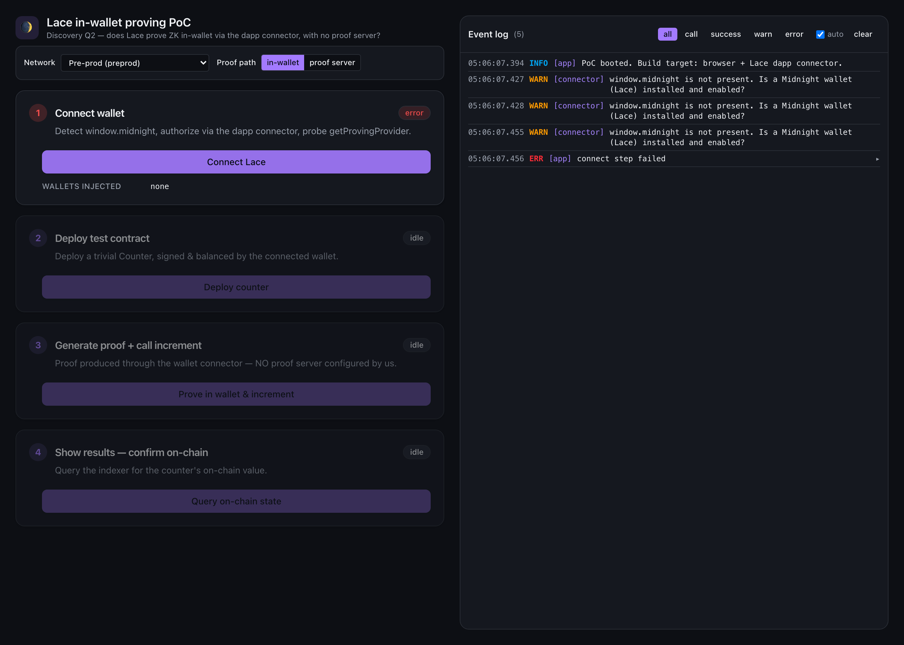

# Lace in-wallet proving PoC

A Vite + React 19 web app that **empirically answers discovery question Q2**:

> Does the current Lace (Midnight) wallet perform ZK proving **in-wallet** via the
> dapp-connector flow, making a fully client-side DApp viable with **no local proof server**?

It walks through four clickable steps — **connect → deploy → prove+call → confirm on-chain** —
with an on-page timestamped log panel (mirrored to the browser console) so every SDK call and
response is observable. The critical step (3) produces the ZK proof through the wallet connector
with **no proof server configured by the app**.



---

## TL;DR findings (verified while building this)

All three provider names the PRD §10 flagged as *unverified* **exist as named** on npm at `4.1.1`,
though one is described slightly imprecisely:

| PRD name | Exists? | Actual package / import | Note |
| --- | --- | --- | --- |
| `dappConnectorProofProvider` | **Yes** | `@midnight-ntwrk/midnight-js-dapp-connector-proof-provider` → `dappConnectorProofProvider(api, zkConfig, costModel)` | Not literally "hooked to `window.midnight`": it takes the **connected** wallet API (`Pick<WalletConnectedAPI,'getProvingProvider'>`), i.e. the object returned by `window.midnight[uuid].connect(networkId)`. |
| `FetchZkConfigProvider` | **Yes** | `@midnight-ntwrk/midnight-js-fetch-zk-config-provider` → `class FetchZkConfigProvider` | `new FetchZkConfigProvider(baseURL, fetch)`. |
| `levelPrivateStateProvider` | **Yes** | `@midnight-ntwrk/midnight-js-level-private-state-provider` → `levelPrivateStateProvider({ accountId, privateStoragePasswordProvider })` | 4.x requires `accountId` + a password provider. |

**The in-wallet-proving mechanism is real and stable in the SDK.** The connector API v4
(`@midnight-ntwrk/dapp-connector-api@4.0.1`) exposes
`getProvingProvider(keyMaterialProvider): Promise<ProvingProvider>` — documented as *"delegate proving
to the wallet"* — and its `Configuration.proverServerUri` is now **optional + `@deprecated`** ("likely
to not be present, as different proving modalities emerge"). `dappConnectorProofProvider` wraps
`getProvingProvider` into the transaction-level `ProofProvider` that `deployContract`/`callTx` consume.

**What source cannot tell us — and this app is built to test:** whether the *specific Lace build the
owner has installed* implements connector v4 (`getProvingProvider`) or an older generation
(`balanceAndProveTransaction` + a required `proverServerUri`). That is settled at runtime — see the
[owner test script](#owner-test-script).

---

## Network targeted, and why

**Pre-prod, indexer/RPC API v4.** Every current Midnight tutorial and the live "Environments and
endpoints" reference (<https://docs.midnight.network/relnotes/network>) drive Pre-prod via
`connect('preprod')` + `setNetworkId('preprod')` (a **string**, not the old `NetworkId` enum). The old
public `testnet-02` is deprecated; "testnet" is now realised as Preview/Preprod. Pre-prod is the PRD's
preferred target, is live, and is reachable today. Endpoints (defaults; the app prefers whatever the
wallet reports from `getConfiguration()`):

- Indexer GraphQL: `https://indexer.preprod.midnight.network/api/v4/graphql`
- Indexer WS: `wss://indexer.preprod.midnight.network/api/v4/graphql/ws`
- Node RPC: `https://rpc.preprod.midnight.network`
- Proof server (control path only): `http://localhost:6300`

The network selector in the UI also offers **Preview** and **Local (undeployed)**. Whatever you pick,
you must select the **same network inside Lace**.

---

## How it works

```
Step 1  connect     window.midnight → discover wallets → connect('preprod')
                    → probe: typeof api.getProvingProvider === 'function'  ← Q2 capability check
                    → getConfiguration() (indexer/node/prover URIs, networkId)

Step 2  deploy      deployContract(providers, { compiledContract: counter })
Step 3  prove+call  deployed.callTx.increment()      ← THE proving event
Step 4  results     publicDataProvider.queryContractState(addr) → ledger(state).round
```

The **provider suite** (`src/midnight/providers.ts`) — the `MidnightProviders` object both
`deployContract` and `callTx` require:

| provider | implementation |
| --- | --- |
| `zkConfigProvider` | `FetchZkConfigProvider(<origin>/zk/counter, fetch)` — serves the compiled ZK artifacts statically |
| `proofProvider` | **`dappConnectorProofProvider(api, zkConfig, CostModel.initialCostModel())`** for the in-wallet path (no proof server), **or** `httpClientProofProvider('http://localhost:6300', zkConfig)` for the control path |
| `privateStateProvider` | `levelPrivateStateProvider(...)` (browser IndexedDB; the counter has no private state but the provider is still required) |
| `publicDataProvider` | `indexerPublicDataProvider(indexerUri, indexerWsUri, WebSocket)` |
| `walletProvider` + `midnightProvider` | hand-rolled adapter over the connector (`src/midnight/walletAdapter.ts`) — there is **no** official `window.midnight → WalletProvider` helper. `balanceTx` → `wallet.balanceUnsealedTransaction`; `submitTx` → `wallet.submitTransaction` |

The **contract** is the canonical `midnightntwrk/example-counter` (single `round: Counter` ledger, one
`increment()` circuit, no witnesses), compiled with the Compact CLI compiler **0.31.1** with **full ZK
artifacts** (no `--skip-zk`). Output lives in `contract/managed/counter/`; the prover/verifier keys and
zkir are copied to `public/zk/counter/` so the dev server serves them and the zk-config provider (and,
for in-wallet proving, the wallet's `KeyMaterialProvider`) can fetch them.

> Proving happens **inside** `deployContract` and `callTx`, *before* balancing/submission. So even if
> the balance/submit glue needs a tweak against a specific Lace build, you still observe the proving
> attempt (Q2 evidence) in the logs first.

---

## Prerequisites

- **Node 22+** and **pnpm** (installs are done with the `sfw pnpm` wrapper).
- **Compact CLI** with compiler **0.31.1** (`compact update`) — only needed if you re-compile the contract.
- **Lace (Midnight) browser extension**, set to **Pre-prod**, with a funded account (you need a little
  **DUST** to pay tx fees — top up NIGHT from the Pre-prod faucet at
  <https://faucet.preprod.midnight.network/> and let DUST generate).
- **(control path only)** A local proof server on `http://localhost:6300`
  (`docker run -p 6300:6300 midnightnetwork/proof-server -- 'midnight-proof-server --network preprod'`).

## Run

```bash
cd pocs/lace-proving
sfw pnpm install

# (optional) re-compile the contract with full ZK artifacts and re-sync to public/
sfw pnpm run compile-contract

sfw pnpm run dev            # http://localhost:5173
```

Other scripts: `sfw pnpm run typecheck` (tsc --noEmit), `sfw pnpm run build` (tsc + vite build),
`sfw pnpm run smoke` (Playwright headless boot test).

> If `sfw pnpm run <script>` aborts on an "ignored build scripts" notice, run the underlying binary
> directly (e.g. `./node_modules/.bin/vite`, `./node_modules/.bin/tsc --noEmit`). The native builds
> (`esbuild`, `classic-level`, …) are **not** needed: esbuild ships prebuilt platform binaries and the
> `level` backends are Node-only and unused in the browser bundle.

---

## Owner test script

The headless smoke test cannot exercise the wallet — that needs **your** browser with Lace. Do this:

### Setup
1. Install/enable **Lace (Midnight)**, create/unlock an account, set network to **Pre-prod**, and make
   sure it has some **DUST** (fund NIGHT from the faucet if needed).
2. In Lace's settings, **note whether a proof-server address is configured** (older Lace requires one;
   connector v4 in-wallet proving should not). Leave it as-is.
3. `sfw pnpm install && sfw pnpm run dev`, open <http://localhost:5173>, open **DevTools → Network** and
   filter on `6300` (and keep the Console open). Leave the **Proof path** toggle on **in-wallet**.

### Run the steps (watch the on-page log after each)
1. **Connect wallet** → approve in Lace. In the log, confirm:
   - `wallet [...] generation=v4` (not `legacy`). A `legacy`/`unknown` generation means this Lace build
     predates connector v4 and **cannot** prove in-wallet via this path — record that as the answer.
   - `capability probe: getProvingProvider() IS present → wallet advertises IN-WALLET proving`.
   - `wallet reports NO proverServerUri` (a printed `proverServerUri` is a red flag that proving is
     expected to go to a server).
2. **Deploy test contract** → approve/sign in Lace. Expect a contract address + deploy tx hash.
3. **Generate proof + call increment** — the decisive step. While it runs, watch for:

   | Signal | In-wallet proving (Q2 = **YES**) | Delegated to a proof server (Q2 = **NO**) |
   | --- | --- | --- |
   | **Network tab (`localhost:6300`)** | **No** requests to `:6300` at all | Requests to `:6300/prove` (+`/check`) appear |
   | **Lace UI** | Lace surfaces a **proving/approval prompt** and does the work itself | No proving prompt; work happens in your proof-server container |
   | **Log timing** | `dappConnectorProofProvider … ok` then `callTx.increment() … ok (several seconds)` — the multi-second gap is the wallet proving | The multi-second gap coincides with `:6300` traffic |
   | **With the proof server stopped** | Still succeeds | Fails / hangs |

   > Strong confirmation: **stop any local proof server**, keep Proof path = **in-wallet**, and re-run.
   > If step 3 still produces a proof and the tx is accepted, proving is unambiguously **in-wallet**.
4. **Show results → Query on-chain state** → expect `on-chain round = 1` (2 after a second increment),
   read back from the indexer. This confirms the proven tx was accepted on-chain.

### Control comparison
Flip **Proof path → proof server**, start a proof server on `:6300`, and re-run steps 2–4. You should
now see `:6300/prove` traffic in the Network tab. This is the baseline that in-wallet proving is
measured against.

### What each outcome means for Q2
- **In-wallet path succeeds with zero `:6300` traffic (proof server stopped)** → Lace proves in-wallet;
  a **fully client-side DApp with no local proof server is viable**. Q2 = **yes**.
- **`getProvingProvider` absent / `generation=legacy`, or proving only works via `:6300`** → current
  Lace still delegates proving to a proof server; a no-proof-server DApp is **not** viable with that
  build. Q2 = **no (for this build)**.

Capture the log panel (and the Network tab) for whichever outcome you get — that is the artefact that
answers Q2. Every step also mirrors to the browser console, and a failing step logs exactly where and
why.

---

## What was verified here (evidence)

- **Contract compiles with full ZK artifacts** — compiler `0.31.1`, `ledger-8.0.2`, runtime `0.16.0`;
  `managed/counter/keys/increment.{prover,verifier}` (14 KB / 1.3 KB) + `zkir/increment.{zkir,bzkir}`
  generated (no `--skip-zk`).
- **TypeScript typechecks against the real installed SDK** — `tsc --noEmit` is clean; the full
  deploy/prove/query wiring is written against the actual `4.1.1` `.d.ts` files, not remembered shapes.
- **Production build succeeds** — `vite build` bundles the WASM (ledger-v8, onchain-runtime-v3).
- **App boots** — `playwright test` (headless) passes: renders all four steps + the log panel and
  degrades gracefully when `window.midnight` is absent (the expected headless state).

## Caveats / residual risk

- Targets **connector v4**. If your Lace injects an older connector, step 1 reports it (`generation`,
  and the `getProvingProvider` probe) rather than crashing — which is itself the Q2 answer for that build.
- The `walletProvider`/`midnightProvider` adapter (balance + submit) and the Bech32m→hex key conversion
  are **hand-rolled against a very new connector-v4 surface** and can't be validated without a live
  wallet; if a serialization/encoding detail is off for your Lace build, the logs pinpoint the exact
  seam. Proving (the Q2 crux) is wired via the canonical, published `dappConnectorProofProvider` and is
  not affected by that glue.

## File map

```
contract/
  src/counter.compact              canonical example-counter contract (increment())
  src/witnesses.ts                 empty witnesses (CounterPrivateState)
  managed/counter/                 compiled output incl. full ZK keys + zkir
public/zk/counter/{keys,zkir}/     ZK artifacts served statically for the zk-config provider
scripts/sync-zk-artifacts.mjs      copies managed/ ZK artifacts → public/
src/
  config.ts                        networks (preprod/preview/undeployed), ZK base URL, proving modes
  lib/logger.ts                    observable logger + <LogPanel> binding + traced()
  lib/hex.ts                       hex <-> Uint8Array
  midnight/connector.ts            window.midnight detection, connect(), getProvingProvider probe
  midnight/walletAdapter.ts        connector v4 → WalletProvider + MidnightProvider
  midnight/providers.ts            provider suite, deploy / increment / query
  components/LogPanel.tsx          scrolling, filterable, timestamped log panel
  components/StepCard.tsx, ui/     shadcn + Tailwind v4 UI
  App.tsx                          the four-step flow
tests/smoke.spec.ts                headless boot test
```
